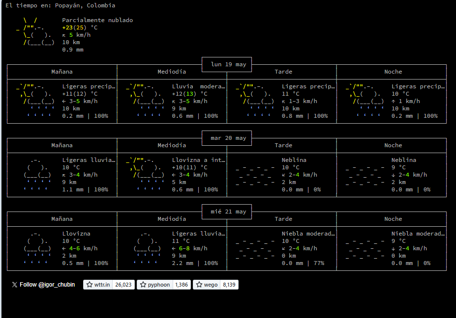
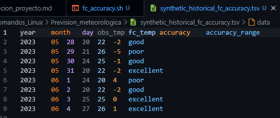

# Comparación de Previsiones Meteorológicas en Tiempo Real

Este proyecto realizar la creacion de una canalizacion (ETL, Extract, transfom and load) para extraer el diagnostico del clima diario y datos de clima observados en un reporte een vivo para el analisis y almacenamiento de informacion para terceros.

El analisis del proyecto de prediccion climatica permite monitoriar y medir la precision historica de la temperatura para fuentes y estaciones climaticas.

Como prueba de concepto (POC), solamente se requerira hacer una unica estacion y fuente. El registro se realizara cada mediodia, reuniendo la temperatura real como la temperatura pronosticada para el medio dia del siguiente, en este caso para la ubicacion Casablanca, Marruecos. 



El proyecto se encuentra estructurado de la siguiente manera, todos los archivos se encuentra disponibles en la carpeta Prevision_metereologica,

```bash
Prevision_meteorologica/
│
├── Imagenes/
│   ├── Servicio_metereologico.png
│   └── Reporte_clima.png
│
├── rx_poc.log               # Registro tabular diario de temperaturas
├── rx_poc.sh                # Script para obtener y registrar datos
├── fc_accuracy.sh           # Script para calcular precisión de pronósticos
├── historical_fc_accuracy.tsv # Archivo con historial de precisión
└── weekly_stats.sh          # Script para resumen semanal

```

# Fuentes de datos
Para implementar este proyecto meteorologico se proporcionara la fuente de recursos https://wttr.in, servicio web que proporciona informacion del tiempo en un formato simple de leer.

La informacion obtenida mediante el comando `curl wttr.in/casablanca` extrae los datos meteorologicos de la siguiente manera

# Descripcion general
El reporte climatico en este proyecto permite desarrollar los siguientes aspectos ligados a la creacion scripting en shell, las actividades que involucra se describen a continuacion:

- Descargar datos meteorologicos en bruto
- Extraer datos de interes de los datos en bruto
- Transformar los datos 
- Cargar datos en un archivo de registro utilizando un formato tabular
- Programar todo el proceso para que se efecute automaticasmente en una hora establecida diariamente


Empezando por el reporte del clima, se debe extraer y almacenar los datos del dia por su registro de hora, local, para Casablanca, Marruecos:

### Pasos a seguir para la creacion  delarchivo deregistro del reporte del clima

1.1 Creacion de archivo de registro rx_poc.log
En este archivo se registrara el reporte del clima POC, conteniendo el texto que contiene un historial creciente de los datos del clima se van a recopilar. Cada entreda en el archivo debe registrarse en filas diferentes.


Considerando el ambiente del proyecto se ejecuta en terminal es siguiente comando:

```bash
# Ejercutar en consola
touch rx_poc.log
# agregar encabezado al informe del clima
header=$(echo -e "year\tmonth\tday\tobs_temp\tfc_temp")
echo $header>rx_poc.log

```

1.2 Continuamos con la descarga de datos meteorologicos en bruto , para ello se crea un script de shell llamado rx_poc.sh para la extraccion de datos.

```bash
touch rx_poc.sh
# dentro del scrip se incluye el shebang de Bash
#! /bin/bash
# Posteriormente se hace ejecutable el archivo
chmod u+x rx_poc.sh
```

Nota: dentro de rx_poc.sh  se encuentra el mecanismo utilizado para la extraccion de datos de un archivo de texto plano a partir de la manipulacion de archivos. En este archivo se recojen datos que se asignaran a las variables `obs_temp` y `fc_temp`.

Es importante considerar que el archivo rx_poc.sh realiza el proceso de extraccion donde se debe tener en cuenta los caracteres ocultos, dado que no se pueden realizar operaciones aritmeticas con texto formateado de esta manera se necesitara reconocer delimitadores para analizar apropiadamente la linea en cada campo. Finalmente se almacena el dia, mes y ano actuales en la variable de shell correspondiente.

1.3 Se se establece un horario para que el Script se ejecute cada dia al medoi dia, tal que se llame a cargar los datos del dia considerando la zona horaria.

para crear una tarea en crontab se ejecutan los siguiente comandos
```bash
crontab -e
# Dentro de la interfaz de crontab se ejecutan los siguientes comandos
0 8 * * * /home/Prevision_meteorologica/rx_poc.sh
```

1.4 Ahora se procede a la creacion del archivo de reporte, en este caso se crea un script para medir y reportar la presicion de diagnosticode la temperatura respecto a la temperatura actual.

```bash
# Se crea el archivo de reporte
echo -e "año\tmes\tdía\tobs_temp\tfc_temp\tprecisión\trango_precisión" > historical_fc_accuracy.tsv
# Tambien se crea el scrip llamado fc_accuracy.sh
touch fc_accuracy.sh

```

el archivo fc_accuracy.sh se utiliza para etiquetar la prediccion que se tuvo y en terminos generales que tan buena la prediccion, dado que el script se ejecuta periodicamente se genera un historico de precision de cada uno de los registros columnares.

La evaluacion del diagnostico segun el clima obtenido se valora segun la siguiente tabla de referencia:

| Margen de error angular | Descripción |
| ----------------------- | ----------- |
| +/- 1°                  | Excellent   |
| +/- 2°                  | Good        |
| +/- 3°                  | Fair        |
| +/- 4°                  | Poor        |

los datos reposrtados dentro del archivo historcal_fc_accuracy luego de ejecutarse diariamente se podrian visualizar de la siguiente manera dentro del archivo:


Finalmente para sintetzar la informacion encontrada dentro del reporte de `historical_fc_accuracy.tsv` se  procede procede a realizar un resumen estadistico de los datos obtenidos en la ultimca semana, como lo muestra el script llamado `weekly_stats.sh` se calculan los dedos de la medida minima y maxima  diferencial en registros consecutivos obtenidos.


Finalmente, se debe considerarse que si se quiere dejar de registrar datos dentro del historico, se debe desactivarse la tarea del gestor de tareas `crontab`