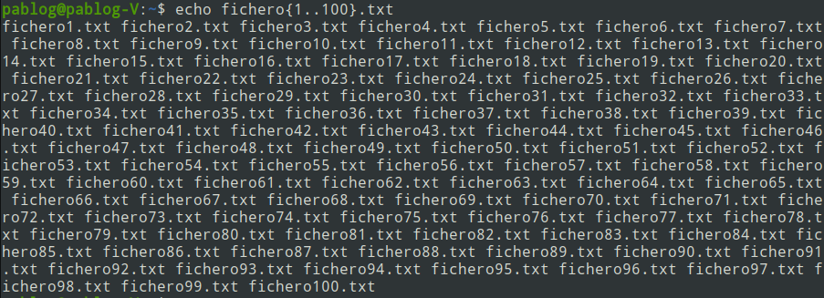
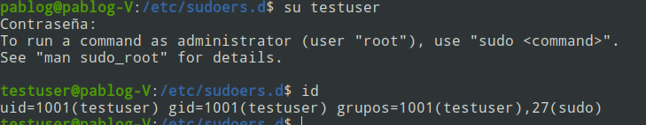

## Comodines
Los comodines son determinados simbolos que realizan operaciones generales que se aplican sobre los archivos de una ruta. Es muy similar a las expresiones regulares, los mas populares son lo siguientes:
1.  * : Este comodin permite abreviar que la descripcion siguiente del archivo puede tener el nombre cualquiera
2.  ? : reemplara el valor de cualquier caracter que se encuentra en esta posicion del texto
3.  :digito: : para expecificar la existencia de un digito 
4.  :alpha:  : para caracteres
5.  :alnum:  : para elementos alfanumericos
6.  :upper:  : para mayusculas

```bash
cat fichero[[!:digito:]].txt   # Indica el fichero junto a un digito
cat fichero[[:alpha:]].txt   # Indica el fichero junto a un digito
cat fichero[[:alnum:]].txt   # Indica el fichero junto a un digito
cat fichero[[:upper:]].txt   # Indica el fichero junto a un digito

```
Es importante tener cuidado con este tipo de comodines, cuando se utiliza el comando rm, dado que podria traer consecuencias al eliminar archivos en operaciones como la siguiente

```bash
rm * .csv   # Evitar cometer este tipo de errores dado qu ees imposible recuperar la informacion de esto 
rm -rf /    
```

### Ejercicios de practica con usar los comodines
1. Busca todos los ficheros que se encuentran en /usr/bin u terminan por un numero
2. Busca todos los ficheros en el sistema de ficheros de Linux que contenga dos carecteres _ en el nombre y terminen en .txt
3. Busca todos los ficheros en /var/log que no terminen en .log

```bash
#Solucion 1:
find /usr/bin  -name '*[[:digito:]]'
```
```bash
#Solucion 2:
find /  -name '*_*_*.txt' 2> /dev/null
```
```bash
#Solucion 3:
find /var/log -name '*[!.log]' 2> /dev/null
find /var/log -type f -not -name "*.log"
```
Las expresiones regulares en linux son muy importantes dado que podemos crear muchas operaciones para encontrar archivos, algunas de ellas son las siguientes:

```bash
ls fichero* # Busca todos los elementos que sean de tipo fichero
mkdir texto{1..5}.txt    #Generar archivo enumerados desde el 1 al 5 
```

La shell tiene la capacidad de expandir las respuestas que nosotros deseamos ver en consola, para eso se utiliza el comando echo, que tiene la capacidad de mostrar en pantalla el resultado de una variable, pero al mismo tiempo puede realizar la expansion de una consulta.

```bash
echo ~
echo * 
echo /*/log   # se puede extraer todos los directorios que tengan a log dentro de la ruta raiz
```
Se pueden realizar operaciones aritmeticas pero se debe tener en cuenta que estas se llevan a cabo dentro de la siguiente estructura

```bash
    $((5 + 2))
    cat fichero_$((3+2)).txt
    echo fichero{1,2,3}.txt
    echo fichero{1..100}.txt
```

 ### EXPANSION DE LA SHELL
Tal que la expansion en la shell es una poderosa herramienta que permite crear de forma automatica archivos y elementos. Podriamos crear carpetas que se separen por anio y agregar cada los 12 meses para almecenar informacion temporal.

```bash
    mkdir {2020..2024}-{01..12}
```
### SUSTITUCION DE COMANDOS CON $  o `
Se pueden utilizar comandos de sustitucion para tomar la salida de un comando como entrada para el siguiente, en este situacion se ejecuta el comando entre parentesis para ser empleado en encomandos un poco mas complejos, en el siguiente ejemplo a continuacion se demuestra

```bash
    ls -la $(which cat)
    ls -la `which cat`  #Exactamente lo mismo a lo anterior
    echo $(python3  -c 'print("Hola mundo")')
```

### Diferenciacion entre las comillas dobles y comillas simples en linux
`''` se utiliza para tomar el texto literal que se escribe en la shell, es decir que considera el espacio en blanco tal cual se escribe en la consola, tomas las palabras separadas por uno o mas espacios y tomaran como un unico argumento.
```bash
    echo 'Este es un texto compredo con    espacios'
```

`""`  va a provocar que todos los caracteres especiales pierdan el significado excepcion de $ \ `, esto quiero decir que cuando se utiliza "" no expande nada de la expresion que este dentro de ella a menos que se utilicen las excepciones.

`$` funciona como comando de expansion debido a que lo que este dentro de el va realizar una operacion.
```bash
    echo "La ruta de cat es: $(which cat)"
```
Las comillas simples se pueden combinar con las commillas dobles para poder en la salida de consola las comillas en pantalla.

`\` este comando se puede utilizar para quitarle el significa especial a una expresion tal como lo muestra la siguiente expresion:

```bash
    echo "esto es una expansion $(which cat), y esto no es una expansion \$(which cat)"
```
utilizar el parametro de escape o -e permite obtener utilizar los caracteries especiales sobre el texto


Se pueden redireccionar datos de texto a 2 rutas diferentes utilizando la siguiente expresion:
```bash 
    ls -lah > ls-salida.txt 2>&1
    ls -lah  &> ls-salida.txt  # Envia ambas salidas a una misma salida
```

La ruta `/dev/null` (fichero especial para volcar todos los mensajes de error ) es una direccion donde todo lo que se envie sera eliminado del sistema.

Otro dato interesenta es que siempre la redireccion pasa primero por el fichero de stdin hasta stdout, pero teniendo en cuenta que si no pongo un parametro de entrada, por ejemplo cat > archovot.txt  espera a que ingrese por consola el texto que sera almacenado en el archivo final, en un sentido contrario se puede hacer la redireccion a stdin, tal que se puede imprimir en consola lo que se encuentra almacenado en un archivo de texto cat < nuevofichero.txt


## Pipelines

La tambien llamada canalizacion se encarga de conectar el stdout de un comando con el stdin del siguiente comando, esto quiere decir que se direcciona a un siguiente comando la entrada de un valor. Ejemplo:

```bash
    ls -l /usr/bin | sort | unique | less   
```
Hay que tener en cuenta que en ocaciones la secuencia de comandos implementada no se alinea al objetivo esperado, esto quiere decir que algunos comandos no coinciden para que su salida sea la entrada del siguiente linea.

### Filtro de resultados
Utilizamos el comando grep para hacer busqueda de patrones dentro de una ruta o archivo, en esta ocasion podremos utilizar el comando grep:

```bash
    grep pgarzon /var/log/auth.log  # Lineas que coinciden on el patron pgarzon dentro de la ruta descrita
    ls /usr/bin | sort | uniq | grep zip

    ls /usr/bin | sort | tee fichero_sort.txt | uniq | grep zip
```


### Ejercicio con pipelines
Completar las actividades utilizando las herramientas de filtrado y busqueda de inforamcion que se han presentado en los temas anteriores:

1. Mostrar por pantalla todos los archivos y directorios que se tienen en el directorio de trabajo, organizado por tamano
2. Crear un nuevo fichero en Linux ejecutando el siguiente comando: echo -e "rojo,1,coche,madrid\nazul,4,moto,mexico\namarillo,2,bicicleta,paris\nverde,6,avion,roma" > fichero.csv

Ordenar el fichero por el segundo campo teniendo en cuenta que los campos estan separados por el delimitador ,

3. Mostrar por pantalla la linea 55 del fichero auth.log que se encuentra en /var/log

SOLUCION:
1. ls -l ~ | sort -h -k5

2.  sort -t ',' -nk2 fichero.csv

3. head -n 55 /var/log/auth.log | ln | tail -1


Existen otro tipo de comandos interesantes como sed que se utilizan principalmente para reemplazar texto de un fichero. Sin embargo, puede utilizarse en combinacion con otros comandos para reemplazar o sustituir una cadena de texto en un fichero, reemplazar una cadena de texto en una linea determinada de un fichero y achadir caracter al comiento de cada linea de un fichero.


## Permisos y usuarios en linux:

En linux, nos encontramos con los conceptos de usurio y grupo, elementos que gestionan los permisos y seguridad de un sistema.
Los usuarios se utilizan para administrar y tomar permisos sobre archivos y recursos de forma local.
Los grupos permiten aignar y administrar permisos de manera global a varios usuarios a mismo tiempo, facilitando la gestion cuando varias personas necesitan accesos similar a cierto recurso.

```bash
    cat /etc/passwd   # Informacion de los usurios que existen
    cat /etc/group    # Muestra los grupos que existen
```
Los ficheros mas importantes siempre pertenecen al usuario root, y no se pueden hacer cambio sobre esos archivos. A menos que accedamos como superadministrador o usuario root  mediante  `sudo su`.

su: Cambia de usuario (normalmente root), pide la contraseña del usuario destino.
sudo: Ejecuta un comando como root, pide tu propia contraseña.
sudo su: Da una shell de root, usando contraseña si tiene permisos sudo.

La mascara permite configurar los permisos por defecto que se establecen para los usuarios, grupos y otros. Se puede configurar en forma octal tal de la siguietne manera

```bash
    umask 0000   # Modificarse para dar permisos por defecto a todos los archivos 
    umask 0006   # Da lectura y escrituro para el grupo de otros.
```

### Permisos especiales
El setuid es un permiso especial en sistemas Linux/Unix que se aplica a **archivos ejecutables**. Cuando un archivo tiene el bit setuid activado, cualquier usuario que ejecute ese arhicho lo hara con los permisos del propietario del archivo.

Como funciona?
Si un programa tiene el bit setuid y es propietario del root, cualquier usuario que lo ejecute, temporalmente tendra permisos de root solo mientras se ejecuta ese programa.

Podemos activarlo de la siguiente manera:
```bash
    chmod u+s archivo  # De otra manera chmod 4770 archivo
```

El setgid (set group ID) permiso especial de linuz que se aplica sobre **archivos ejecutables como directorios** . Se emplea cuando un arachivo ejecutable tiene el bit setgid activado cualquier usuario que lo ejectute lo hara con los permisos del grupo propietario del archivo, si en el caso de un directorio se encuantra activado, todos los archivos y subdirectorios dentro del directorio tendran permisos

Podemos activarlo de la siguiente manera:

```bash
    chmod g+s archivo_o_directorio # De otra manera chmod 2770 archivo
```


El sticky bit permiso especial. Cuando el sticky bit está activado en un directorio, solo el propietario de un archivo (o el usuario root) puede borrar o renombrar archivos dentro de ese directorio, aunque otros usuarios tengan permisos de escritura sobre el directorio.

Esto es muy útil en directorios como /tmp, donde muchos usuarios pueden crear archivos, pero no deberían poder borrar o modificar los archivos de otros.
```bash
    chmod 1777 nombre_del_directorio  # chmod +t nombre_del_directorio
```

El comando **su** se utiliza para poder emplear  la shell con otro usuario, en esta ocasion podemos ingresar a cualquier usuario que tengamos disponible.

**sudo** es un comando que nos va a servir para ejecutar otros comandos con privilegios de administrador, hay que tener en cuenta que este comando puede  realizar operaciones de bajo nivel en el sistema operativo y que ofrece accesibilidad a usuarios que se encuentran dentro del archivo sudoers.

```bash
    sudo visudo  # Ingresa el archivo de privilegios de usuario
```

Para la seguridad de los usuarios se recomienda dar permisos de usuario creando los grupos y posteriormente agregando los usuarios a los grupos con niveles de permiso.

Para agregar los usuarios de los grupos se utiliza la siguiente sintaxis:

```bash
    sudo usermod -aG sudo testuser # donde se considera sudo usermod -aG [grupo] [usuario]

    adduser newUserContat # Wrapper, interfaz del comando useradd
    useradd newUseContat  # Comando de bajo nivel
    addgroup newGroup  # wrapper, interfaz del comando groupadd
    groupadd newGropu # comando de bajo nivel para agregar un nuevo grupo
    sudo -a -G newgroup newuser # Este comando sirve para agregar un un grupo al usuario
    sudo usermog -g newgroup newuser # Cambio de grupo primario de un usuario
    # Podemos cambiar la ruta donde se ubica un usuario
    sudo usermod -d /home/pgarzon newuser2
    # Cambiar uid de los usuario
    sudo usermod -u 250 newuser2
```

para observar todos los grupos y usuarios que tenemos en el sistemas podemos buscarlos en las rutas /etc/passwd y /etc/group

Asi como se puede observar a continuacion en pantalla  se agrega el usuario.


La asignacion de un usuario o grupo a un archivo puede realizarse  de la siguiente manera:

 ```bash
    sudo chown [usuario][grupo_propietario] archivo.txt
    sudo chgrop sudo preuba.txt  # Comando antiguo para el cambio de propietario
 ```

Algo importante es darnos cuenta que los comandos se encuentran almacenados como ejecutables dentro del directorio de archivos de la ruta principal, la que son consultados en la ruta $PATH y posteriormente son traidos y aplicados sobre los argumentos ingresados.

## PROCESOS EN LINUX
Linux es un sistema multitarea, es decir que es capaz de realizar multiples procesos no en forma paralela sino secuencial tan rapido que refleja los procesos como si fueran hechos al mismo tiempo. 

En el directorio /proc podemos observar los procesos que se encuentran activos, los procesos  funcionan como un directorio dinamico que tiene carpetas que se agregan y se eliminan a medida que realizamos operaciones dentro del sistema operativo.

se pueden realizar muchas operaciones dentro de linux y estas pueden ser establecidas en primer plano o en segundo plano. En segundo plano la terminal se detiene para no realizar muchos mas procesos, mientras que en primer plano la terminal queda unicamente disponible para el proceso que se queda desarrollando.

```bash
    bg %[identificador pid]  # comando para operaciones segundo plano
    fg %[identificador pid]  # comando para operaciones primer plano

```
###  Sen'ales en linux
Los programas en linux se mantienen pendiente de las senales que reciben del SO para realizar algun tipo de actuacion. 

Utilizado el comando **kill** podremos enviar senales a procesos si identificamos el pid y adicionalmente agregamos el tipo de senal que deseamos agregar.

```bash
    kill -20 40005  # Detiene el proceso de el ejecutable que se tiene de momento
    kill -18 40005  # Reanuda el proceso que se encontraba congelado
    # Otro ejemplo particular es mediante los argumentos -TOP y -CONT
```

Todas las senales del sistemas de pueden observar con el comando kill  -l, se debe tener en cuenta que las sen'ales realizan diferentes tipos de acciones y eso depender del indicador de senal que utilicemos.

### Init, deminios y servicios 

**Demonio: ** Es un proceso o programa que se realiza en segundo plano que no tiene interaccion con el usuario y se realiza en segundo plano.
**Servicio: ** Es un proceso en segundo plano que recibe interaccion de otros procesos a traves de la red.

 ```bash
    ls /etc/init.d   # aqui se encuentran todos los servicios del sistema
    ls /etc/init     # programas que se ejecutan al inicio  de arranque del SO
 ```
Para conocer el estado de un servicio utilizamos la sintaxis: ./apparmor status. Tenemos el comando systemctl para gestionar el control de servicios, se debe utilizar los argumentos tipo stop, start o statuts para cambiar el estado de un servicio

service envuelve el comportamiento de systemctl para manitular un servicios y se puede utilizar de la siguiente manera
```bash
    sudo service apparmor restart
    systemctl list_units --type=service # Muestra una lista de todos los servicios disponibles
```

El proceso de arranque de un sistema en linux considera una serie de etapas que se establecen secuencialmente. El proceso comienta en la BIOS, Se encarga de realizar comprobaciones de integridad del sistema, busca, carga y ejecuta el programa cargador de arranque, es decir, MBR (Master Boot Record) que se encuentra en el primer sector del disco de arranque, esta compuesto por la informacion del cargador de arranque primario, informacion de la tabla de particiones y comprobacion de validacion del mbr. Tambien contiene informacion sobre el GRUB o LILO y se encarga de cargar y ejecutar el cargador de GRUB.

El GRUB (Grand Uniffied Bootloaer), contiene imagenes del kernel instaladas en su sistema que pueden ser ejecutadas, carga la imagen por defecto del kernel, este archivo se encargara de cargar y ejecutar la imagen del kernel y del initrd


Sniffer : Realiza una copia de trafico de red para analizarlo y visualizar el tipo de trafico, observar si hay enbotellamiento o si hay anomalias. Se utiliza el comando tcpdump que permitira capturar todo el trafico de red.

```bash
    sudo tccpdump -i enp03
    sudo wireshark [interfaz de host]
    sudo nmap -sS [direccionRed/mascara]
```

## Descarga  de informacion mediante los comando Curl y Wget
Comandos utilizados para transferir datos desde o hacia un servidor, es compatible con multiples protocolos de comunicacion tal como DICT, FILE, FTP, FTPS, GOPHER, GOPHERS, HTTP, HTTPS,IMAP, LDAP, MQTT, POP3, POP3S, RTMP, RTMPS, RTSP, SCP, SFTP, SMB, SMBS, SMTPS, TELNET or TFTP.

Util para realizar peticiones a una API, extraer informacion del head de una api.
la principal diferencia de utilizar estos dos comandos es que **curl**  bloquea la pantalla hasta terminar proceso, no se puede realizar otro tipo de accion pero es util para utilizar los comandos de expansion o combinaciones regex. Por otro lado, wget permite descargar ficheros de manera no interactiva, es decir que se puede realizar en segundo plano mientras se realizan otras tareas. Para ver los procesos de descarga se peude utilizar el comando

```bash
    tail wget-log
```

Podemos realizar conexiones a mv de forma remota a portir del comando SSH, un protocolo de seguridad que permite la conexion remota mediante la shell. la sintaxis para conectarse a una maquina remota es la siguiente:
```bash
    ssh nombreUsuario@direccionIP  # Ten en cuenta la contrasena porque luego se pide
```

Tenemos el comando **ss**  comando utilizado para visualizar las siguiente conexiones y configurar sockets, se pueden observar detalles respecto al estado, direccion y proceso que se estan realizando (conexiones activas, en escucha o terminadas)

## Gestion de paquetes en linux

Corresponde  al metodo de instalar y mantener el software del sistema Linux, corresponde con uno de los aspectos mas importantes y diferenciadores de una distribucion de linux. El software de linux cambia constantemente, por lo tanto el codigo fuente se compila y se intala cada vez que se realiza una actualizacion. Los sistemas gestores de paquetes son:
- Estilo Debian (.deb) : para distribuciones tipo debian, ubuntu, lunux Mint, Raspbian
- Estilo ReadHat (.rpm) Fedora, CentOs, RedHat, OpenSuse
